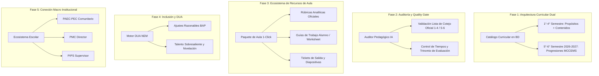

# PLAN MAESTRO DE ACTUALIZACIÓN Y EVOLUCIÓN: SIGPDA-EMS
> **Estado:** Documento Oficial de Arquitectura y Hoja de Ruta  
> **Fecha de creación / Última actualización:** Ciclo Escolar 2026-2027  
> **Plataforma:** SIGPDA-EMS (Sistema Integral de Gestión de Planeación Didáctica Automatizada de Educación Media Superior)  
> **Ámbito:** Bachillerato General Estatal (BGE), Bachillerato Digital y EMSAD  

---

## 1. ANTECEDENTES Y MARCO NORMATIVO CLAVE (2026-2027)

### 📌 Régimen de Transición Curricular Oficial:
1. **Semestres 1.°, 2.°, 3.° y 4.° (Ciclo 2026-2027 en adelante):**
   - **Modelo:** **Propósitos Formativos y Contenidos Formativos** (Conceptos Centrales, Conceptos Transversales y Temas Oficiales).
   - **Normativa:** Lineamientos DBEPA 2026-2027, Anexo 12 CC 1-4, Listas de Cotejo oficiales 1-4.
2. **Semestres 5.° y 6.° (ÚNICAMENTE Ciclo 2026-2027):**
   - **Modelo:** **Progresiones de Aprendizaje** (Metas, Categorías y Subcategorías MCCEMS 2022, Anexo 12 CC 5-6).
   - **Ciclo 2027-2028 en adelante:** Las progresiones quedan completamente extintas en toda la EMS, unificando todo el bachillerato bajo el esquema de Propósitos y Contenidos Formativos.
3. **Instrumentos de Evaluación Existentes en la Plataforma:**
   - La plataforma y sus repositorios documentales (`documentos_referencia`) ya cuentan con:
     * *03 Lista de cotejo Plan de Clase 1-4_SEM*
     * *04 ANEXO 12 CC 1-4*
     * *ANEXO 12 CC 5-6*
     * *Guía de Retroalimentación Secuencia Didáctica Formación Laboral 2026-2027*
     * *S1 Guía Retro S2_Secuencia Didáctica 26 27*
     * *Rúbricas analíticas, escalas estimativas y listas de cotejo oficiales*

---

## 2. BENCHMARKING DE REPOSITORIOS Y ARQUITECTURAS EXTRAÍDAS

A partir de la investigación profunda de repositorios globales de IA educativa, se integran los siguientes patrones de diseño:

| Repositorio / Proyecto | Aportación Técnica / Pedagógica | Implementación en SIGPDA-EMS |
| :--- | :--- | :--- |
| **`SirhanMacx/Claw-ED`** | Paquete integral de aula (Planes + Guías alumno + Diapositivas + Rúbricas + Tickets salida) + Filtro de calidad. | **Ecosistema de Recursos de Aula 1-Click** + **Auditor Pedagógico IA**. |
| **`dfdb76/bncc-mcp`** | Currículo nacional estructurado en BD consultable por IA con herramientas sin alucinación. | **Catálogo Curricular Dual en Neon Postgres** (Propósitos/Contenidos 1°-4° y Progresiones 5°-6°). |
| **`686f6c61/teacher`** | Verificabilidad, citas de página/párrafo y anclaje estricto a documentos oficiales. | **Citas normativas exactas en diagnósticos PMC y PIPS** desde la Normateca SEP. |
| **`michael-borck/curriculum-curator`** | Soporte para metodologías activas (ABP, STEAM, Aprendizaje Servicio, Casos, Gamificación). | **Selector de Metodologías Activas NEM** en el asistente de planeación. |
| **`KRASA-AI/education-ai-skills`** | Modularidad de prompts para DUA (Diseño Universal para el Aprendizaje) y diferenciación. | **Módulo de Adaptaciones DUA / Inclusión** en 1 clic para estudiantes con BAP. |
| **`ai4ed/LessonPlanLM`** | Evaluación multidimensional de calidad (coherencia, progresión taxonómica, tiempos). | **Semáforo de Calidad Pedagógica** antes de la descarga del documento. |

---

## 3. HOJA DE RUTA DE IMPLEMENTACIÓN EN FASES

---

### 🚀 FASE 1: Motor Curricular Dual & Selector Inteligente de UACs
**Objetivo:** Eliminar la fatiga de captura del docente y asegurar que la IA trabaje con información curricular oficial y exacta según el semestre.

1. **Estructura en Base de Datos (`curriculum_catalog`):**
   - Para 1.° a 4.° Semestre: `uac_id`, `semestre`, `componente`, `proposito_formativo`, `contenidos_formativos` (Conceptos centrales, transversales y temas).
   - Para 5.° y 6.° Semestre (Ciclo 2026-2027): `uac_id`, `semestre`, `progresion_numero`, `progresion_texto`, `metas`, `categorias`, `subcategorias`.
2. **Interfaz de Usuario con Cero Fricción (Zero-Friction Prompting):**
   - El docente selecciona: *Subsistema -> Semestre -> Asignatura (UAC)*.
   - La plataforma autocompleta automáticamente los contenidos oficiales y ajusta las preguntas del formulario según corresponda (Propósitos/Contenidos vs. Progresiones).
3. **Regla de Dosificación Horaria Matemática:**
   - 3 Cortes de 6 semanas exactas.
   - Cálculo automático de horas por corte: `Carga semanal × 6 semanas = Horas por corte`.

---

### 🛡️ FASE 2: Auditor Pedagógico IA (Quality Gate con Listas de Cotejo Oficiales)
**Objetivo:** Garantizar que ninguna planeación se entregue con errores metodológicos o de formato antes de ser descargada.

1. **Integración de Instrumentos Oficiales de DBEPA:**
   - Auditoría automatizada contra los reactivos de la *Lista de Cotejo Plan de Clase 1-4_SEM* y *Guía de Retroalimentación Oficial*.
2. **Dimensiones de Inspección IA:**
   - **Dimensión 1 (Estructura y Tiempos):** Cuadre exacto de horas en los 3 Cortes de evaluación.
   - **Dimensión 2 (Metodología Activa):** Nivel 1 en Apertura, Nivel 2 práctico/aplicado en Desarrollo, Cierre reflexivo/simulación.
   - **Dimensión 3 (Trinomio de Evaluación):** Evidencia de Producto + Evidencia de Desempeño + Instrumento objetivo (Rúbrica/Lista de cotejo) que sume 100%.
   - **Dimensión 4 (Contextualización PAEC):** Articulación explícita con la problemática comunitaria.
3. **Widget de Semáforo de Calidad:**
   - Indicador visual (🟢 Excelente, 🟡 Ajuste sugerido, 🔴 No cumple) con botón: *"Corregir observaciones automáticamente con IA"*.

---

### 📦 FASE 3: Ecosistema de Recursos de Aula (Paquete Didáctico Integral 1-Click)
**Objetivo:** Convertir la planeación en un set de herramientas prácticas listas para el salón de clases (Inspirado en *Claw-ED*).

1. **Generador de Rúbricas Analíticas Ponderadas:**
   - Generación de tablas con Criterios, Niveles de Desempeño (Excelente, Satisfactorio, En Proceso, Requiere Apoyo) y porcentaje de ponderación, exportable a Word/PDF.
2. **Listas de Cotejo y Escalas Estimativas:**
   - Formatos institucionales listos para calificar productos y desempeños técnicos.
3. **Guía de Trabajo del Estudiante (Worksheet Imprimible):**
   - Transforma las actividades de la planeación en una ficha de trabajo limpia y atractiva para el estudiante.
4. **Tickets de Salida (Exit Tickets):**
   - Mini-evaluaciones de 5 minutos al cierre de la sesión para medir el aprendizaje formativo.
5. **Generador de Diapositivas / Esquemas de Clase:**
   - Estructuración de diapositivas en Markdown/HTML descargables para proyección en aula.

---

### 🧩 FASE 4: Módulo DUA (Diseño Universal para el Aprendizaje) e Inclusión
**Objetivo:** Cumplir con el mandato de inclusión de la Nueva Escuela Mexicana sin sobrecargar al docente.

1. **Adaptaciones Curriculares Asistidas:**
   - En cada secuencia didáctica, botón **"Adaptar con DUA"**.
   - Generación de variantes para:
     * Alumnos con Barreras para el Aprendizaje y la Participación (BAP).
     * Ajustes para diversidad de canales de representación (visual, auditivo, kinestésico).
     * Actividades de enriquecimiento para alumnos con talento sobresaliente.
     * Estrategias de nivelación para alumnos con rezago.

---

### 🌐 FASE 5: Articulación Integral de la Suite Institucional (PAEC ↔ Planeación ↔ PMC ↔ PIPS)
**Objetivo:** Crear una plataforma interconectada donde directores, supervisores y docentes compartan la misma visión pedagógica respetando la privacidad.

1. **Vinculación PAEC ↔ Asignatura:**
   - Al crear una planeación, el docente puede seleccionar el PAEC institucional de su escuela para heredar automáticamente la problemática comunitaria y el plan de acción.
2. **PMC con Diagnóstico Comunitario y Normativa:**
   - Generación del Plan de Mejora Continua para directores y su respectivo Informe Final en formato DOCX oficial.
3. **PIPS para Supervisores:**
   - Generación modular en 3 Chunks con análisis de los planteles de la zona escolar.

---

### 🧠 FASE 6: Memoria de Estilo Docente y Refinamiento Granular
**Objetivo:** Que la IA se adapte a la identidad única de cada profesor y permita edición de precisión.

1. **Aprendizaje de Preferencias (Biblioteca Personal):**
   - La IA lee los materiales de la biblioteca personal del docente para calibrar tono, vocabulario y dinámicas favoritas.
2. **Edición Granular en Tiempo Real:**
   - Posibilidad de regenerar solo un bloque (ej. *"Reescribir solo el Cierre con una dinámica de gamificación"* o *"Cambiar el instrumento de evaluación a Lista de Cotejo"*).

---

## 4. METODOLOGÍA DE TRABAJO SUGERIDA

Para trabajar este plan con máxima velocidad, rigor técnico y sin riesgo de romper nada de lo que ya funciona:

1. **Desarrollo Modular por Fases:**
   - Abordamos una fase a la vez, validando en cada paso que los generadores y esquemas de base de datos sigan funcionando al 100%.
2. **Memoria y Registro Continuo:**
   - Toda decisión, modificación o nuevo componente se registrará en `PLAN_MAESTRO_ACTUALIZACION.md` y `MEMORIA.md` para preservar la continuidad en todas las sesiones.
3. **Verificación Técnica y Pedagógica Constante:**
   - Validación visual y funcional en la interfaz de Next.js, asegurando cumplimiento con los documentos y listas de cotejo de la DBEPA / SEMS.

---
*Este plan queda fijado en el repositorio como la guía rectora de desarrollo para SIGPDA-EMS.*
